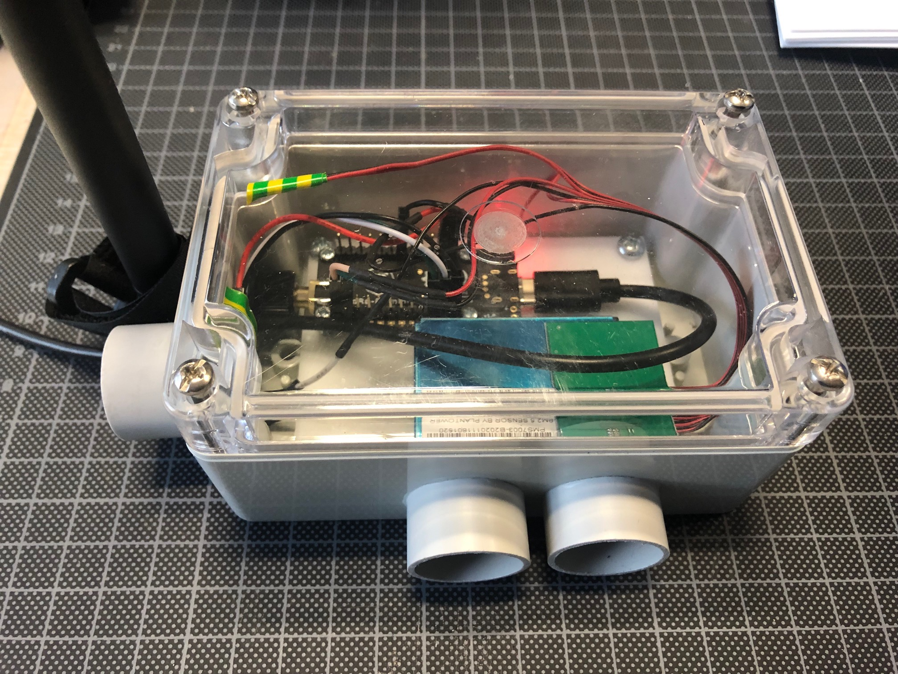
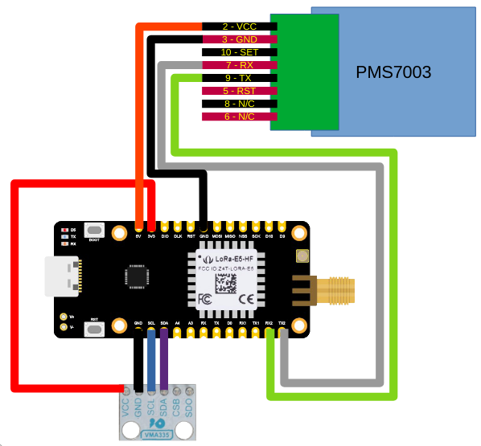
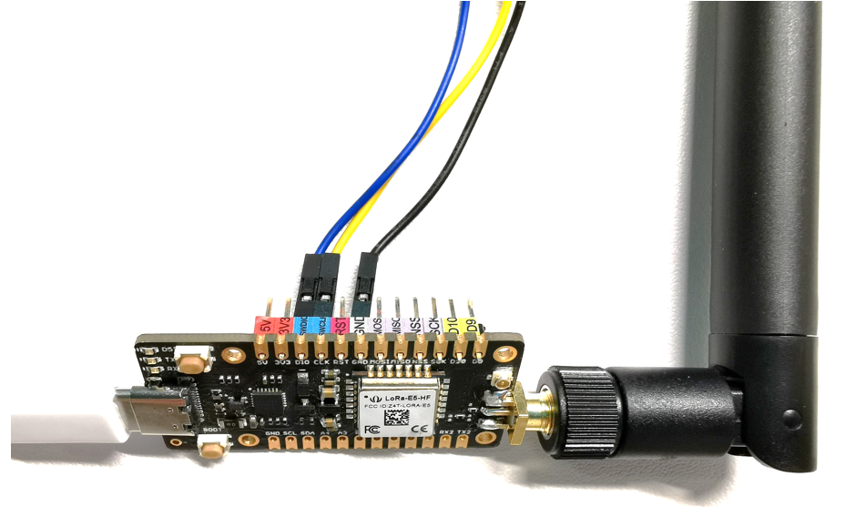

# Air Quality Station with BMX280 and PMS7003

## Description

The program sends periodically LoRaWAN frames with environmental measurements from Bosch BMX280 and Plantower PMS7003 sensors.



## Wiring



## Build

Build the firmware
```bash
export RIOTBASE=~/github/RIOT-OS/RIOT
make
```
## Flashing

Connect the LoRa E5 Mini pins to the STLink flasher

```
Pin 1: VDD_TARGET (VDD from application) --> NC
Pin 2: SWCLK (clock)                     --> Pin DLK (Yellow)
Pin 3: GND (ground)                      --> Pin GND (Black)
Pin 4: SWDIO (SWD data input/output)     --> Pin DIO (Blue)
Pin 5: NRST (RESET of target STM32)      --> NC
```

> Check steps 7 and 8 in the [wiki](https://wiki.seeedstudio.com/LoRa_E5_mini/).
> Step 7. Open STM32CubeProgrammer, connect ST-LINK to your PC, hold RESET Button of your Device, then click Connect and release RESET Button:
> Step 8. Make sure the Read Out Protection is AA, if it is shown as BB, select AA and click Apply:




## Flash with OpenOCD

Build and flash the firmware
```bash
export RIOTBASE=~/github/RIOT-OS/RIOT
make flash-only
```

> Remark: The version of `openocd` should be `0.11.0+`


## Console

Open the serial console of the LoRa E5 board

```bash
brew install tio
tio -L
tio -b 115200 -m INLCRNL /dev/tty.usbserial-142xxx
```

or
```bash
make term
```

or
```bash
minicom -s
```

## Setting DEVEUI APPEUI APPKEY

By default, the DevEUI, the AppEUI and the AppKey are forged using the CPU ID of the MCU. However, you can set the DevEUI, the AppEUI and the AppKey of the LoRaWAN endpoint into the `main.c`.

Optional : Configure the following parameters into the program file `main.c` : `FIRST_TX_PERIOD`, `TX_PERIOD`, `DR_INIT`, `ADR_ON`, `DEBUG_ON` and `SECRET`.
```bash
make SECRET=cafebabe02ffffffcafebabe02000001 binfile
```

The AppKey can be recovered from the DevEUI (displayed at startup) and the SECRET (flashed into the firmware) with the command lines below:
```bash
SECRET=cafebabe02000001cafebabe02ffffff                                         
DevEUI=33323431007f1234                                                         
AppEUI=33323431ffffffff                                                        
SHA=$(echo -n $DevEUI$AppEUI$SECRET | xxd -r -p | shasum -b | awk '{print $1}')
AppKey="${SHA:0:32}"
echo $AppKey
```

The DevEUI, the AppEUI and the AppKey can be set by fixing DEVEUI APPEUI APPKEY into the `make` command
```bash
make DEVEUI=33323431007f1234 APPEUI=33323431ffffffff APPKEY=f482a62f0f1234ac960882a2e25f971b binfile
```

## Downlink

The application can send a downlink message to the endpoint throught your network server.

Downlink payload can be used for
* sending an ASCII message (port = 1)
* setting the tx period of the data (port = 3)
* setting the realtime clock of the endpoint (port = 202)
* rebooting the board immedialy (port = 64)
* rebooting the board after 1 minute (port = 65)
* rebooting the board after 1 hour (port = 66)

> Remark: Chirpstack implements the [App Clock Sync Specification](https://lora-alliance.org/resource-hub/lorawanr-application-layer-clock-synchronization-specification-v100). The synchronization is done at the LNS level.

## Payload format

### Uplink

* byte 0: error flags : bit0 if error on BMX280, bit1 if error on PMS7003

If there is no error with BMX280
* byte 1-2 : temperature 
* byte 3-4 : pressure
* byte 5-6 : humidity

If there is no error with PMS7003
* byte 7-8   :  pm1_0Standard
* byte 9-10  :  pm2_5Standard
* byte 10-11 :  pm10Standard
* byte 12_13 :  pm1_0Atmospheric
* byte 14_15 :  pm2_5Atmospheric
* byte 16_17 :  pm10Atmospheric

* byte 18_19 :  particuleGT0_3
* byte 20_21 :  particuleGT0_5
* byte 22_23 :  particuleGT1_0
* byte 24_25 :  particuleGT2_5
* byte 26_27 :  particuleGT10

Javascript decoder for main LNS is [codec/decoder.js](codec/decoder.js)

## TODO
* [ ] add GPIO for resetting the PMS7003 (pin RST) : `PA9` or `PB10`
* [ ] fix RTC sync


## Basic test

```bash
cd ~/github/RIOT-OS/RIOT
cd tests/pkg_semtech-loramac
BOARD=lora-e5-dev LORA_DRIVER=sx126x_stm32wl gmake -j 16 clean flash
```
